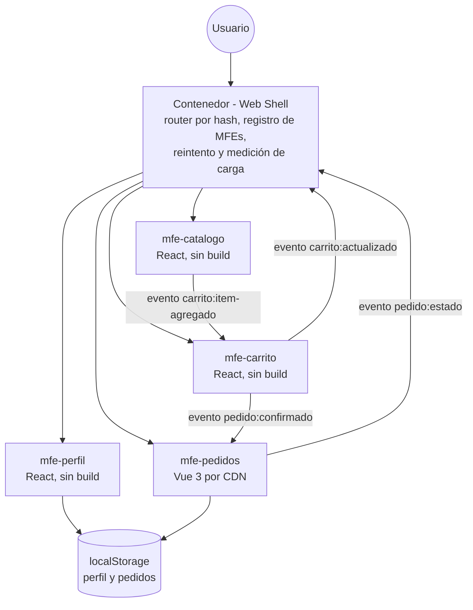

# SaborUPC 2.0

Aplicación de micro frontends para la Actividad 2 de Arquitectura de Aplicaciones Web. Cada micro frontend (MFE) vive en su propia carpeta, corre en su propio servidor y se comunica con los demás únicamente a través de eventos del navegador, sin importarse entre sí.

## Arquitectura



El contenedor no conoce el código interno de ningún MFE: solo sabe su nombre, su ruta, la URL de su script y el objeto global que expone (`window.MFE_<nombre>`). La comunicación entre MFEs ocurre por `CustomEvent` en `window`, documentados en [`contenedor/CONTRATOS.md`](./contenedor/CONTRATOS.md).

## Cómo ejecutar cada pieza

Requisitos: Node.js (LTS) instalado.

Cada carpeta se sirve de forma independiente. Abre una terminal por carpeta y ejecuta, dentro de ella:

```powershell
npx http-server . -p <puerto> -c-1 --cors
```

Reemplaza `<puerto>` según la tabla de abajo. `-c-1` desactiva la caché (necesario para ver cambios al instante) y `--cors` permite que el contenedor cargue scripts de otro puerto.

Con los cinco servidores corriendo, abre `http://localhost:3000` en el navegador.

Para probar el MFE de Seguimiento de pedidos de forma aislada (sin el contenedor), abre `http://localhost:3004/contrato.html`: debe mostrar una lista de verificaciones, todas en ✓.

## Tabla de puertos/URL

| Carpeta | Puerto | URL |
|---|---|---|
| `contenedor` | 3000 | http://localhost:3000 |
| `mfe-catalogo` | 3001 | http://localhost:3001/catalogo.js |
| `mfe-carrito` | 3002 | http://localhost:3002/carrito.js |
| `mfe-perfil` | 3003 | http://localhost:3003/perfil.js |
| `mfe-pedidos` | 3004 | http://localhost:3004/pedidos.js |

## Rutas de la aplicación

| Ruta | Micro frontend |
|---|---|
| `#/catalogo` | mfe-catalogo |
| `#/carrito` | mfe-carrito |
| `#/pedidos` | mfe-pedidos |
| `#/perfil` | mfe-perfil |

## Decisiones tomadas

- **Comunicación por eventos del navegador (`window.dispatchEvent`/`addEventListener`), no llamadas directas entre MFEs.** Así ningún micro frontend importa código de otro, y cada uno puede cambiar de tecnología o de implementación interna sin romper a los demás, siempre que respete el contrato documentado.

- **Precarga de `mfe-carrito` y `mfe-pedidos`.** Ambos necesitan escuchar eventos (`carrito:item-agregado`, `pedido:confirmado`) aunque el usuario no esté viendo esa pantalla — por ejemplo, agregar algo al carrito desde el catálogo debe actualizar el contador aunque el carrito no esté montado. Por eso el registro del contenedor los marca con `precarga: true` y se cargan al iniciar la aplicación, no al navegar a su ruta.

- **Heterogeneidad tecnológica con Vue 3 cargado desde CDN, sin paso de compilación.** Cumple el requisito de usar una tecnología distinta a la del resto (React), manteniendo el mismo contrato de montaje/desmontaje (`mount(el, props)` / `unmount(el)`) para que el contenedor lo trate igual que a cualquier otro MFE.

- **`localStorage` para persistencia simple (perfil y pedidos).** Al no haber un backend real en esta actividad, se usa el almacenamiento del navegador para que los datos sobrevivan a recargar la página, con las claves separadas por MFE (`perfil:datos`, `pedidos:lista`) para evitar colisiones.

- **`tokens.css` como único sistema de diseño compartido.** Solo variables CSS (colores, tipografía, espaciado), sin componentes ni lógica de negocio, para que React y Vue se vean consistentes sin acoplar su implementación.

- **Resiliencia y observabilidad en el contenedor.** Si un MFE no carga (por ejemplo, su servidor está caído), se muestra un mensaje amigable con botón "Reintentar" en lugar de romper toda la aplicación, y cada carga exitosa se registra en consola con su tiempo (`performance.now()`).

- **Versionado de eventos.** Cada `detail` incluye un campo `version`, y las reglas de evolución (documentadas en `CONTRATOS.md`) exigen que los cambios solo agreguen campos opcionales, para que un consumidor viejo no se rompa si un publicador agrega información nueva.
